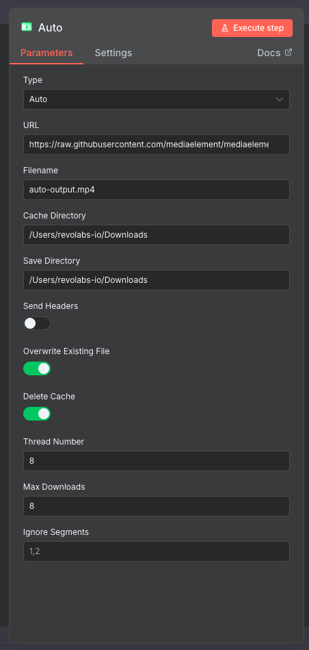

# 🎬 n8n-nodes-video-downloader

[](https://n8n.io/)

A comprehensive n8n community node for downloading and processing video content from various sources including M3U8 streams, direct video files, and social media platforms: Douyin, Weibo, Pipixia, ...

## ✨ Features

- 🎥 **Multiple Video Sources**: Support for M3U8 playlists, direct video files (MP4, MKV, MOV, etc.), and social media platforms (Douyin, Weibo, Pipixia)
- 🔍 **Auto-Detection**: Automatically detects download type based on URL extension
- ⚙️ **Advanced Configuration**: Full control over download parameters including threading, headers, caching, and more
- 📊 **Progress Tracking**: Real-time download progress monitoring
- 🛡️ **Error Handling**: Robust error handling with continue-on-fail options

## 📦 Installation

### Community Node

1. Go to **Settings > Community Nodes** in n8n
2. Search for `n8n-nodes-video-downloader`
3. Click **Install**

### Manual Installation

1. Install the package:
   ```bash
   npm install n8n-nodes-video-downloader
   ```

2. Restart n8n

## 🚀 Usage

### Basic Setup

1. Add the **Video Downloader** node to your workflow
2. Configure the required parameters:
   - **URL**: The video source URL
   - **Filename**: Output filename (e.g., `video.mp4`)

### Supported URL Types

The node automatically detects the download type based on URL patterns:

| URL Type | Auto-Detected As | Examples |
|----------|------------------|----------|
| M3U8 Playlist | `m3u8` | `https://example.com/playlist.m3u8` |
| Video Files | `file` | `https://example.com/video.mp4`<br>`https://example.com/movie.mkv` |
| Social Media | `parser` | Douyin, Weibo, Pipixia URLs |

### ⚙️ Configuration Options

#### Basic Settings
- **Type**: Manual override for download type (`Auto`, `M3U8`, `File`, `Parser`)
- **URL**: Source video URL (required)
- **Filename**: Output filename (required)

#### Directory Settings
- **Cache Directory**: Temporary files storage location
- **Save Directory**: Final output directory

#### Download Control
- **Thread Number**: Concurrent download threads (default: 8, max recommended: 8)
- **Max Downloads**: Maximum concurrent downloads (default: 8)
- **Overwrite Existing File**: Force overwrite if file exists (default: false)
- **Delete Cache**: Remove temporary files after download (default: true)

#### Advanced Options
- **Send Headers**: Enable custom HTTP headers
- **Specify Headers**: Custom headers for requests (name/value pairs)
- **Ignore Segments**: Skip specific time segments (format: `0-10,100-110`)

## Node Properties



## 🛡️ Error Handling

The node includes comprehensive error handling:

- **Continue on Fail**: When enabled, failed downloads won't stop the workflow
- **Detailed Error Messages**: Clear error descriptions for troubleshooting
- **Item Index Tracking**: Errors include item index for multi-item workflows

## ⚡ Performance Considerations

- **Thread Count**: Balance speed vs. server load (recommended: 4-8 threads)
- **Cache Management**: Enable cache deletion to save disk space
- **File Overwrite**: Use carefully to avoid accidental data loss
- **Network Limits**: Respect server limitations and rate limits

## 🕵️‍♂️ Troubleshooting

**Node doesn't appear in n8n:**
- Ensure the package is properly installed
- Restart n8n after installation
- Check console for loading errors

**Download fails:**
- Verify URL is accessible and valid
- Check network connectivity
- Reduce thread count if server rejects requests
- Enable headers if authentication is required

**File not found errors:**
- Ensure output directory exists and is writable
- Check filename doesn't contain invalid characters
- Verify sufficient disk space

**Slow downloads:**
- Increase thread count (if server allows)
- Check network speed
- Consider using a different CDN/source


## 🛠️ Development

### Building from Source

```bash
git clone https://github.com/revolabs-io/n8n-nodes-video-downloader.git
cd n8n-nodes-video-downloader
npm install
npm run build
```

### Testing

```bash
npm run dev
```

This starts n8n with the node loaded for testing.

## 🤝 Contributing

We welcome contributions! Please see our [Contributing Guide](CONTRIBUTING.md) for details.

### Development Setup

1. Fork the repository
2. Create a feature branch: `git checkout -b feature/amazing-feature`
3. Make your changes and add tests
4. Run tests: `npm test`
5. Commit your changes: `git commit -m 'Add amazing feature'`
6. Push to the branch: `git push origin feature/amazing-feature`
7. Open a Pull Request

## 📝 License

This project is licensed under the MIT License - see the [LICENSE](LICENSE) file for details.

## 🙏 Acknowledgments

- [@lzwme/m3u8-dl](https://github.com/lzwme/m3u8-dl) - A command-line tool for batch downloading m3u8 format videos